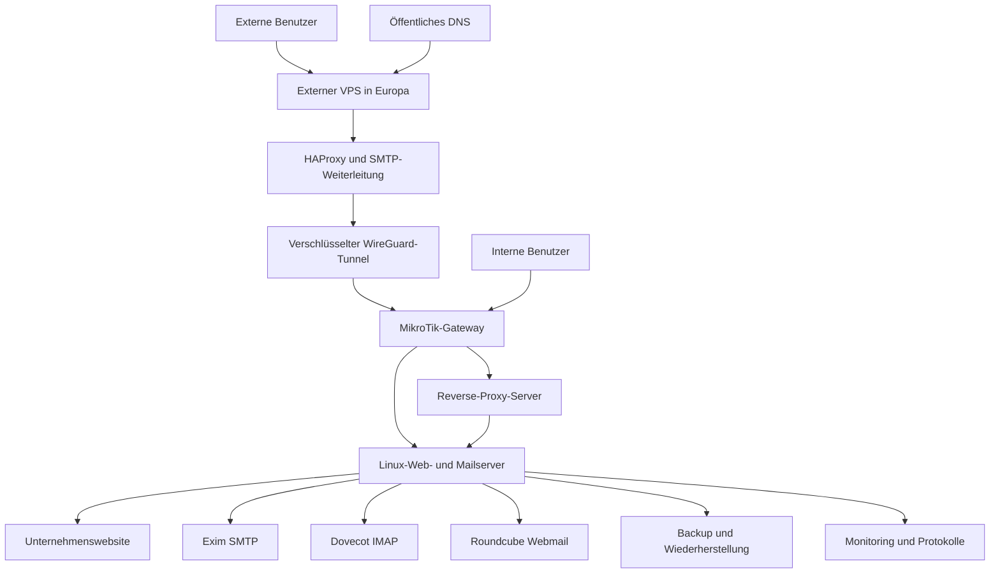

<!-- Public portfolio documentation. No credentials or production configuration. -->

[English](README.md) | [Deutsch](README.de.md) | [فارسی](README.fa.md) | [العربية](README.ar.md)

# Hybride Unternehmens-Web- und Mail-Infrastruktur

> **Bereinigte Produktionsfallstudie:** Dieses Repository dokumentiert ein reales Infrastrukturprojekt, das Milad umgesetzt und betrieben hat. Unternehmensidentität, produktive Domains, Adressen, Zugangsdaten, Konfigurationen, Website-Quellcode, Protokolle, Screenshots und Betriebsgeheimnisse wurden bewusst entfernt.

## Kurzüberblick

Das Projekt verband die Bereitstellung einer Unternehmenswebsite, Linux-basiertes Web- und Mailhosting, HestiaCP, Nginx, Exim, Dovecot, Roundcube, eine Reverse-Proxy-Schicht, einen externen VPS in Europa, HAProxy, WireGuard, MikroTik-Routing, Firewall- und NAT-Regeln, richtlinienbasiertes Routing, domänenabhängige SMTP-Zustellpfade, DNS-Authentifizierung, Backup-Planung und Störungsbehebung.

## Projektkontext

Die Organisation benötigte eine wartbare Plattform für Website und Unternehmensmail. Interne und externe Benutzer sollten über getrennte, kontrollierte Zugriffswege dieselben Kerndienste erreichen. Zusätzlich waren TLS, DNS-basierte Mailauthentifizierung, unterschiedliche ausgehende Zustellpfade und nachvollziehbare Wiederherstellungsverfahren erforderlich.

## Technische Herausforderung

Webhosting, Mailtransport, Remote-Zugriff und Routing mussten als zusammenhängendes System betrieben werden. Fehler in DNS, TLS, Proxying, Firewall-Regeln, Mailrouting oder Anwendungsabhängigkeiten konnten unterschiedliche Schichten desselben Dienstes beeinträchtigen. Daher wurden Verantwortlichkeiten, Vertrauensgrenzen und Prüfabläufe klar getrennt.

## Meine Rolle

Ich entwarf und implementierte die Website-Schicht, administrierte die Linux-Hostingumgebung, konfigurierte Web- und Maildienste, integrierte die sichere Standortverbindung, setzte Routingrichtlinien um, prüfte DNS- und TLS-Verhalten, analysierte Produktionsstörungen und dokumentierte Wiederherstellungsabläufe.

## Was ich umgesetzt habe

- Unternehmenswebsite entworfen, bereitgestellt und in die Hostingumgebung integriert.
- Linux-basierte Web- und Mailplattform aufgebaut und administriert.
- HestiaCP, Nginx, Exim, Dovecot und Roundcube konfiguriert.
- Interne und externe Mailzugriffswege umgesetzt.
- Externen VPS über einen verschlüsselten WireGuard-Tunnel angebunden.
- HAProxy für kontrollierten externen Dienstzugriff konfiguriert.
- MikroTik-Firewall, NAT und richtlinienbasiertes Routing eingerichtet.
- Domänenabhängiges SMTP-Routing mit direkter und weitergeleiteter Zustellung umgesetzt.
- SPF, DKIM, DMARC, MX, PTR und TLS konfiguriert und geprüft.
- Backup-, Validierungs-, Fehleranalyse- und Wiederherstellungsverfahren erstellt.

## Architektur auf hoher Ebene

Die Darstellung ist bewusst allgemein gehalten und enthält keine produktiven Kennungen, Routen, Adressen, Ports oder Providerdaten.

## Web- und Hostingplattform

Ich stellte die Website auf der Linux-Hostingumgebung bereit, konfigurierte HTTPS, verwaltete HestiaCP und Nginx und prüfte Berechtigungen, Dateieigentümer, Logs und Dienstzustände. Produktiver Website-Quellcode und Unternehmensinhalte sind nicht enthalten.

## Mailplattform

Ich konfigurierte Exim für SMTP, Dovecot für den Postfachzugriff und Roundcube für Webmail. Interne und externe Benutzer griffen über TLS-gesicherte Wege auf dieselben Kerndienste zu. Zur Fehleranalyse gehörten Warteschlangen, Logs, Zertifikate, DNS und Routing.

## Interner und externer Zugriff

Interne Benutzer nutzten den internen Routingpfad über das MikroTik-Gateway. Externe Benutzer erreichten ausgewählte Dienste über den externen VPS, HAProxy und den verschlüsselten WireGuard-Tunnel. Die eigentlichen Maildienste blieben in der kontrollierten Hostingumgebung.

## Domänenabhängiges SMTP-Routing

Für verschiedene Absenderdomains wurden unterschiedliche Zustellrichtlinien umgesetzt. Exim klassifizierte die Absenderdomain und wählte entweder die direkte Zustellung oder einen sicheren externen Relay-Transport. Die öffentliche Dokumentation zeigt nur das Prinzip, nicht die produktive Konfiguration.

## DNS und Mailauthentifizierung

MX, SPF, DKIM, DMARC, PTR und TLS wurden als zusammenhängende Zustellkette konfiguriert und geprüft. DNS-Identität, Zertifikate und SMTP-Pfad wurden gemeinsam validiert.

## Sicherheit und Betrieb

Kontrollierte öffentliche Exposition, Firewall- und NAT-Regeln, richtlinienbasiertes Routing, WireGuard-Verschlüsselung, TLS, geschützte Zugangsdaten, getrennte Backups und Prüfungen nach Änderungen waren Bestandteil des Betriebs.

## Störungsbehebung

Bei einem Produktionsvorfall lieferte die Anmeldung am Hosting-Control-Panel einen HTTP-500-Fehler, weil erforderliche PHP-Vendor-Abhängigkeiten nach einer dateisystembezogenen Änderung nicht verfügbar waren. Die Wiederherstellung trennte Website-Inhalte von Control-Panel-Dateien und validierte anschließend die Dienste.

## Ergebnisse

- Web- und Mailbetrieb in einem wartbaren Betriebsmodell gebündelt.
- Kontrollierten internen und externen Zugriff umgesetzt.
- Verschlüsselte Verbindung zwischen Infrastrukturstandorten eingerichtet.
- Direkte und weitergeleitete SMTP-Zustellpfade getrennt umgesetzt.
- Wiederherstellungsbereitschaft durch Dokumentation und Prüfverfahren verbessert.

## Technologien und Fähigkeiten

Linux, Ubuntu Server, HestiaCP, Nginx, Exim, Dovecot, Roundcube, HAProxy, WireGuard, MikroTik RouterOS, SMTP, IMAP, DNS, TLS, SPF, DKIM, DMARC, NAT, Firewall, richtlinienbasiertes Routing, Backup, Monitoring, Fehleranalyse und technische Dokumentation.

## Dokumentation

- [Architektur](docs/architecture.md)
- [Mailplattform](docs/mail-platform.md)
- [Zugriffswege](docs/internal-external-access.md)
- [SMTP-Routing](docs/mail-routing.md)
- [Sicherheit](docs/security.md)
- [Teststrategie](docs/testing-strategy.md)
- [Störungsbehebung](docs/incident-recovery.md)

## Datenschutz

Dieses Repository ist eine bereinigte technische Fallstudie und kein Produktionsbackup oder Deployment-Handbuch.

## Autor

**Milad** 
IT-Infrastrukturtechniker | DevOps-orientiert
