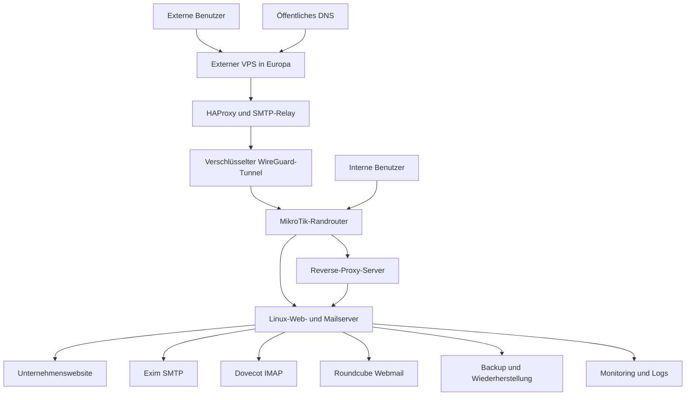

# Hybride Unternehmens-Web- und Mail-Infrastruktur

[English](README.md) | [Deutsch](README.de.md) | [فارسی](README.fa.md) | [العربية](README.ar.md)

> **Bereinigte Produktionsfallstudie:** Dieses Repository dokumentiert ein reales Infrastrukturprojekt, das ich entworfen, umgesetzt, betrieben und analysiert habe. Unternehmensidentität, Domains, Adressen, Zugangsdaten, Produktionskonfiguration, Website-Quellcode, Screenshots, Logs und Backups wurden bewusst entfernt.

[Live-Portfolio öffnen](https://miladateight.github.io/hybrid-web-mail-infrastructure/)

## Zusammenfassung

Das Projekt verband die Bereitstellung einer Unternehmenswebsite mit Linux-basiertem Web- und Mailhosting, HestiaCP, Nginx, Exim, Dovecot, Roundcube, einer Reverse-Proxy-Schicht, einem externen VPS, HAProxy, WireGuard, MikroTik-Routing, Firewall- und NAT-Regeln, Policy-Based Routing, getrennten SMTP-Ausgangspfaden, DNS-basierter Mailauthentifizierung sowie Backup- und Wiederherstellungsprozessen.

Die öffentliche Dokumentation beschreibt die technische Umsetzung und Betriebsverantwortung, ohne Werte offenzulegen, die die produktive Umgebung identifizieren oder gefährden könnten.

## Projektkontext

Die Organisation benötigte eine wartbare Plattform für eine öffentliche Website und Unternehmensmail. Interne Benutzer sollten die Dienste über das Unternehmensnetz erreichen, während externe Benutzer einen kontrollierten Einstiegspunkt benötigten. Zusätzlich mussten unterschiedliche Absenderdomains verschiedene ausgehende Zustellpfade nutzen.

## Technische Herausforderung

- Bereitstellung einer Unternehmenswebsite auf einer Linux-Hostingplattform.
- Zentraler Betrieb von Web, SMTP, IMAP und Webmail.
- Getrennte interne und externe Zugriffswege.
- Verschlüsselte Verbindung zwischen externem VPS und internem Netzrand.
- Firewall, NAT und Policy-Based Routing auf MikroTik RouterOS.
- Direkte SMTP-Zustellung für ausgewählte Domains und Relay-Zustellung für andere Domains.
- Gemeinsame Validierung von DNS, TLS, Routing und Anwendungsdiensten.
- Wiederholbare Backup-, Prüf- und Wiederherstellungsabläufe.

## Meine Rolle

Ich verantwortete die Integration über Web-, Linux-, Mail- und Netzwerkschichten hinweg. Dazu gehörten Website-Bereitstellung, Administration der Hostingplattform, Konfiguration der Maildienste, Integration von Proxy- und Netzwerkkomponenten, Umsetzung der Mailrouting-Richtlinien, Betriebsprüfung sowie Fehleranalyse und Wiederherstellungsdokumentation.

## Was ich umgesetzt habe

- Unternehmenswebsite entworfen und bereitgestellt.
- Linux-basierte Web- und Mailhostingumgebung aufgebaut und administriert.
- HestiaCP, Nginx, Exim, Dovecot und Roundcube konfiguriert.
- Interne und externe Zugriffswege für Web und Mail umgesetzt.
- Einen externen VPS über einen verschlüsselten WireGuard-Tunnel angebunden.
- HAProxy für den kontrollierten externen Zugriff auf ausgewählte Dienste konfiguriert.
- MikroTik-Firewall, NAT und Policy-Based Routing eingerichtet.
- Domänenabhängiges SMTP-Routing mit direkter und weitergeleiteter Zustellung umgesetzt.
- SPF, DKIM, DMARC, MX, PTR und TLS konfiguriert und geprüft.
- Mailwarteschlangen, Logs, TLS-Verhalten und Routingfehler analysiert.
- Backup-, Validierungs-, Fehleranalyse- und Wiederherstellungsprozesse dokumentiert.

## Architektur auf hoher Ebene



Das Diagramm ist bewusst abstrahiert und zeigt Verantwortungsgrenzen statt der exakten Produktionsarchitektur.

## Webplattform

Ich entwarf und deployte die Website-Schicht, bereitete sie für Linux-Hosting vor, integrierte HTTPS und pflegte die Deployment-Dateien. Betriebsprüfungen umfassten HTTP-Verhalten, Zertifikatsgültigkeit, Reverse-Proxy-Verhalten, Dateiberechtigungen und Servicezustand nach Änderungen.

## Hostingplattform

HestiaCP diente als Steuerungsebene für Webdomains, Maildomains, Zertifikate, Postfächer und Backups. Nginx übernahm die Webauslieferung. Linux-Dienste, Berechtigungen, Logs und automatisch erzeugte Konfigurationen wurden als eigene Betriebsbereiche behandelt.

## Mailplattform

Ich integrierte und administrierte:

- **Exim** für SMTP-Empfang, Submission, Routing und Transportauswahl.
- **Dovecot** für den IMAP-Zugriff auf Postfächer.
- **Roundcube** als browserbasiertes Webmail.
- **TLS** für geschützte Client- und Serverkommunikation.
- **DNS-Authentifizierung** für Identität und Zustellbarkeit.

Die Fehleranalyse umfasste Warteschlangen, Logs, Routenauswahl, TLS-Prüfung sowie die Trennung von Anwendungs-, Netzwerk- und DNS-Problemen.

## Interner Zugriff

Interne Benutzer erreichten die Hostingumgebung über das Unternehmensnetz und die MikroTik-Routingkontrollen. Dadurch blieb der interne Zugriff weitgehend unabhängig von der externen Einstiegsschicht, während Web, SMTP, IMAP und Webmail auf derselben verwalteten Plattform betrieben wurden.

## Externer Zugriff

Externe Benutzer gelangten über einen kontrollierten VPS-Einstieg zur Umgebung. HAProxy leitete ausgewählte Verbindungen durch einen verschlüsselten WireGuard-Tunnel zum internen Netzrand. Dort wurden Firewall-, NAT- und Routingentscheidungen angewendet, bevor die Hostingdienste erreicht wurden.

## Domänenabhängiges SMTP-Routing

Die Hostingumgebung bediente mehrere Absenderdomains mit unterschiedlichen Zustellanforderungen. Ich setzte eine Absenderdomain-Klassifizierung um, die pro Nachricht einen von zwei Pfaden auswählte:

1. Direkte ausgehende SMTP-Zustellung.
2. Sichere Zustellung über ein externes SMTP-Relay.

Damit konnten verschiedene Zustellrichtlinien innerhalb einer gemeinsamen Hostingplattform betrieben werden. Die Prüfung umfasste Router- und Transportauswahl, Warteschlangen, Relay-Erreichbarkeit, TLS und DNS-Ausrichtung.

```text
wenn die Absenderdomain zur Relay-Richtlinie gehört:
    sicheren externen Relay-Transport auswählen
sonst:
    direkten ausgehenden Transport auswählen
```

Dies ist Pseudocode und keine Produktionskonfiguration.

## DNS und Mailauthentifizierung

Ich konfigurierte und prüfte die Beziehungen zwischen MX, SPF, DKIM, DMARC, PTR, Mailhostnamen und TLS-Zertifikaten. Diese Bereiche wurden gemeinsam validiert, weil Zustellprobleme häufig mehrere Schichten gleichzeitig betreffen.

## Netzwerk- und Sicherheitskontrollen

- Kontrollierte öffentliche Exposition über eine externe Einstiegsschicht.
- MikroTik-Firewall- und NAT-Grenzen.
- Policy-Based Routing für ausgewählten Datenverkehr.
- Verschlüsselter WireGuard-Transport zwischen Infrastrukturstandorten.
- TLS für Web- und Mailzugriffe.
- Eingeschränkte Administration und Schutz von Zugangsdaten.
- Trennung zwischen öffentlicher Dokumentation und Produktionskonfiguration.
- Backup-Schutz, Logging, Patching und Änderungsvalidierung.

## Validierung und Betrieb

Die Betriebsprüfung umfasste Website-Erreichbarkeit, HTTPS, TLS, DNS- und Mailauthentifizierung, SMTP und IMAP, Exim-Warteschlangen, WireGuard-Peerstatus, HAProxy-Backends, MikroTik-Zähler sowie Backup- und Wiederherstellungsbereitschaft. Produktive Belege und Betriebskennungen sind in dieser öffentlichen Fallstudie nicht enthalten.

## Fallstudie zur Wiederherstellung

Nach einer dateisystembezogenen Änderung lieferte die Anmeldung des Hosting-Control-Panels HTTP 500. Die Untersuchung zeigte, dass ein benötigter PHP-Abhängigkeitslader fehlte und Vendor-Abhängigkeiten geprüft oder wiederhergestellt werden mussten.

Bei der Wiederherstellung wurden Website-Inhalte und Control-Panel-Anwendung getrennt behandelt. Anschließend wurden Web-, Mail- und Verwaltungsdienste einzeln geprüft. Der Vorfall unterstrich die Bedeutung von Pfadprüfung, Änderungsisolation, Abhängigkeitskontrolle und getesteten Wiederherstellungsnotizen.

Siehe [Incident Recovery](docs/incident-recovery.md).

## Ergebnisse

- Web- und Mailbetrieb auf einer wartbaren Linux-Plattform zentralisiert.
- Kontrollierten internen und externen Zugriff auf dieselben verwalteten Dienste ermöglicht.
- Verschlüsselte Verbindung zwischen externen und internen Infrastrukturebenen aufgebaut.
- Unterschiedliche SMTP-Zustellrichtlinien nach Absenderdomain umgesetzt.
- Fehleranalyse durch Logs, Warteschlangen, Zähler und Health Checks verbessert.
- Wiederholbare Backup-, Prüf- und Wiederherstellungsdokumentation erstellt.

Es werden keine erfundenen Kennzahlen oder Verfügbarkeitswerte angegeben.

## Technologien

**Web und Hosting:** HTML, CSS, JavaScript, Linux, Ubuntu Server, HestiaCP, Nginx, Reverse Proxy, TLS  
**Mail:** Exim, Dovecot, Roundcube, SMTP, IMAP, SPF, DKIM, DMARC, MX, PTR  
**Netzwerk:** MikroTik RouterOS, WireGuard, HAProxy, NAT, Firewall, Policy-Based Routing, DNS, TCP/IP  
**Betrieb:** Bash, Logging, Monitoring, Backup, Incident Recovery, Fehleranalyse, technische Dokumentation

## Nachgewiesene Fähigkeiten

- End-to-End-Verantwortung für Infrastruktur
- Linux-Serveradministration
- Netzwerk- und Mailfehleranalyse
- Web- und Mailhosting
- Sichere Remote-Zugriffsarchitektur
- Reverse-Proxy- und SMTP-Relay-Integration
- Domänenabhängiges Mailrouting
- DNS- und TLS-Validierung
- Backup- und Wiederherstellungsplanung
- Ursachenanalyse und Produktionssupport

## Repository-Dokumentation

- [Architektur](docs/architecture.md)
- [Webplattform](docs/web-platform.md)
- [Hostingplattform](docs/hosting-platform.md)
- [Mailplattform](docs/mail-platform.md)
- [Interner und externer Zugriff](docs/internal-external-access.md)
- [Mailrouting](docs/mail-routing.md)
- [Sicherheit](docs/security.md)
- [Teststrategie](docs/testing-strategy.md)
- [Incident Recovery](docs/incident-recovery.md)
- [Projektprüfung](PROJECT_REVIEW.md)

## Portfolio lokal starten

```bash
python3 -m http.server 8080
```

Danach `http://localhost:8080` öffnen. Der direkte Zugriff über `file://` kann das Laden der Sprachdateien blockieren.

## Datenschutz und Vertraulichkeit

Dieses Repository enthält keine reale Unternehmensidentität, Domains, Adressen, Hostnamen, Zugangsdaten, Schlüssel, DNS-Werte, Produktionskonfiguration, ursprünglichen Website-Quellcode, Screenshots, Postfachinhalte, Backups oder Logs. Es ist eine technische Portfolio-Fallstudie und keine Deployment-Anleitung.

## Autor

**Milad**  
IT-Infrastrukturtechniker | DevOps-orientiert
