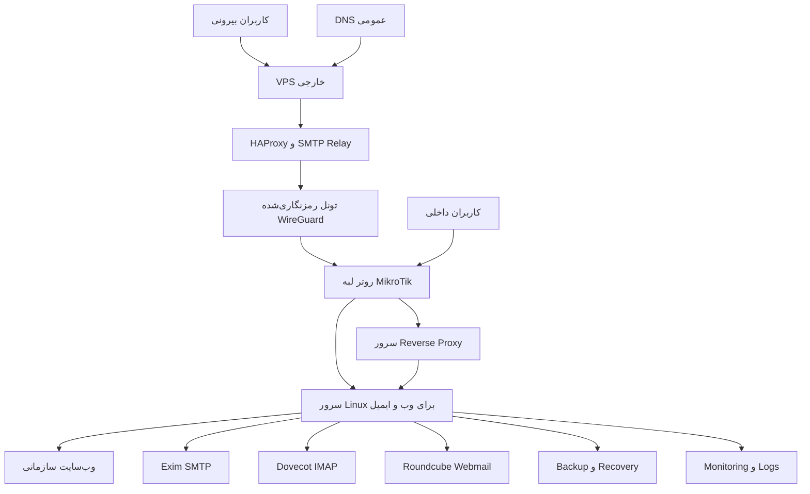

[English](README.md) | [Deutsch](README.de.md) | [فارسی](README.fa.md) | [العربية](README.ar.md)

<div dir="rtl">

# زیرساخت ترکیبی وب و ایمیل سازمانی

> **مطالعه موردی پاک‌سازی‌شده از یک پروژه واقعی:** این مخزن پروژه‌ای را مستند می‌کند که من آن را طراحی، پیاده‌سازی، راه‌اندازی، نگهداری و عیب‌یابی کرده‌ام. نام شرکت، دامنه‌ها، آدرس‌ها، اطلاعات ورود، تنظیمات Production، سورس وب‌سایت، تصاویر، لاگ‌ها و Backupهای واقعی عمداً حذف شده‌اند.

[مشاهده نسخه آنلاین](https://miladateight.github.io/hybrid-web-mail-infrastructure/)

## خلاصه اجرایی

این پروژه طراحی و انتشار وب‌سایت سازمانی، میزبانی وب و ایمیل روی Linux، مدیریت HestiaCP، پیکربندی Nginx، Exim، Dovecot و Roundcube، Reverse Proxy، استفاده از VPS خارجی، HAProxy، WireGuard، مسیریابی MikroTik، Firewall و NAT، Policy-Based Routing، مسیرهای متفاوت ارسال SMTP، احراز هویت ایمیل در DNS، Backup و بازیابی پس از رخداد را یکپارچه کرد.

نسخه عمومی فقط تصمیم‌های مهندسی و مسئولیت اجرایی را نشان می‌دهد و هیچ مقداری که بتواند زیرساخت واقعی را شناسایی یا در معرض خطر قرار دهد منتشر نمی‌کند.

## زمینه پروژه

سازمان به یک پلتفرم قابل نگهداری برای وب‌سایت عمومی و ایمیل سازمانی نیاز داشت. کاربران داخلی باید از مسیر شبکه شرکت به سرویس‌ها دسترسی می‌داشتند و کاربران بیرونی باید از یک نقطه ورود کنترل‌شده استفاده می‌کردند. همچنین بعضی دامنه‌های ارسال‌کننده باید مستقیماً ایمیل ارسال می‌کردند و بعضی دامنه‌ها باید از Relay خارجی عبور می‌کردند.

## چالش مهندسی

- انتشار وب‌سایت سازمانی روی محیط میزبانی Linux.
- مدیریت متمرکز Web، SMTP، IMAP و Webmail.
- طراحی مسیرهای جدا برای دسترسی داخلی و خارجی.
- اتصال امن VPS خارجی به لبه شبکه داخلی با WireGuard.
- اعمال Firewall، NAT و Policy-Based Routing روی MikroTik.
- انتخاب مسیر ارسال مستقیم یا Relay بر اساس دامنه فرستنده.
- هماهنگ نگه داشتن DNS، TLS، Routing و سرویس‌های Mail.
- ساخت فرآیندهای تکرارپذیر برای تست، Backup و Recovery.

## نقش من

من مسئول یکپارچه‌سازی لایه‌های وب، Linux، ایمیل و شبکه بودم. وب‌سایت را طراحی و Deploy کردم، پلتفرم میزبانی را مدیریت کردم، سرویس‌های ایمیل و Proxy را پیکربندی کردم، سیاست مسیریابی ایمیل را پیاده‌سازی کردم، رفتار سرویس‌ها را اعتبارسنجی کردم و عیب‌یابی Production و مستندسازی بازیابی را انجام دادم.

## کارهایی که پیاده‌سازی کردم

- طراحی و Deploy لایه نمایشی وب‌سایت سازمانی.
- راه‌اندازی و مدیریت محیط میزبانی وب و ایمیل روی Linux.
- پیکربندی HestiaCP، Nginx، Exim، Dovecot و Roundcube.
- پیاده‌سازی مسیرهای دسترسی داخلی و خارجی برای وب و ایمیل.
- اتصال VPS خارجی به شبکه داخلی با تونل رمزنگاری‌شده WireGuard.
- پیکربندی HAProxy برای دسترسی کنترل‌شده به سرویس‌های منتخب.
- پیکربندی Firewall، NAT و Policy-Based Routing روی MikroTik.
- پیاده‌سازی مسیریابی خروجی SMTP بر اساس دامنه با مسیر ارسال مستقیم و مسیر Relay.
- پیکربندی و اعتبارسنجی SPF، DKIM، DMARC، MX، PTR و TLS.
- بررسی Mail Queue، لاگ سرویس‌ها، رفتار TLS و خطاهای Routing.
- تدوین روش‌های Backup، تست، عیب‌یابی و Recovery.

## معماری سطح بالا

</div>



<div dir="rtl">

این نمودار عمداً ساده‌سازی شده و فقط ارتباط اجزای اصلی و مرز مسئولیت‌ها را نشان می‌دهد، نه توپولوژی دقیق Production.

## پلتفرم وب

لایه وب‌سایت را طراحی و Deploy کردم، آن را برای میزبانی روی Linux آماده کردم، HTTPS و Reverse Proxy را یکپارچه کردم و فایل‌های Deployment را نگهداری کردم. بررسی‌های عملیاتی شامل رفتار HTTP، اعتبار TLS، Permission فایل‌ها و وضعیت سرویس‌ها بعد از هر تغییر بود.

## پلتفرم میزبانی

HestiaCP نقش Control Plane را برای Web Domain، Mail Domain، Certificate، Mailbox و Backup داشت. Nginx لایه وب را ارائه می‌کرد و مدیریت سرویس‌های Linux، Permissionها، Logها و Configهای تولیدشده توسط Control Panel به‌صورت جداگانه انجام می‌شد.

## پلتفرم ایمیل

من این اجزا را یکپارچه و مدیریت کردم:

- **Exim** برای دریافت SMTP، Submission، Routing و انتخاب Transport.
- **Dovecot** برای دسترسی IMAP به Mailboxها.
- **Roundcube** برای Webmail تحت مرورگر.
- **TLS** برای ارتباط امن Client و Server.
- **DNS Authentication** برای هویت و Deliverability ایمیل.

عیب‌یابی شامل بررسی Queue، تحلیل Log، انتخاب Route و Transport، اعتبارسنجی TLS و تفکیک خطاهای Application، Network و DNS بود.

## مسیر دسترسی داخلی

کاربران داخلی از شبکه شرکت و Routing کنترل‌شده MikroTik به محیط میزبانی دسترسی داشتند. این مسیر وابستگی کمتری به نقطه ورود خارجی داشت و Web، SMTP، IMAP و Webmail را روی همان پلتفرم مدیریت‌شده ارائه می‌کرد.

## مسیر دسترسی خارجی

کاربران بیرونی از یک VPS کنترل‌شده وارد می‌شدند. HAProxy ترافیک منتخب را از طریق تونل WireGuard به لبه شبکه داخلی هدایت می‌کرد. سپس MikroTik سیاست‌های Firewall، NAT و Routing را اعمال می‌کرد و ترافیک به سرویس‌های میزبانی می‌رسید.

## مسیریابی SMTP بر اساس دامنه

چند دامنه روی یک محیط Mail Hosting قرار داشتند، اما سیاست ارسال خروجی یکسانی نداشتند. من طبقه‌بندی بر اساس دامنه فرستنده را پیاده‌سازی کردم تا هر پیام یکی از دو مسیر را انتخاب کند:

1. ارسال مستقیم SMTP به Mail Server مقصد.
2. ارسال امن از طریق SMTP Relay خارجی.

این جداسازی اجازه داد سیاست‌های متفاوت بدون انتقال همه دامنه‌ها به یک مسیر واحد اعمال شوند. اعتبارسنجی شامل انتخاب Router و Transport در Exim، وضعیت Queue، دسترسی Relay، TLS و هماهنگی DNS بود.

</div>

```text
اگر دامنه فرستنده در سیاست Relay باشد:
    Transport مربوط به Relay امن خارجی انتخاب شود
در غیر این صورت:
    Transport ارسال مستقیم انتخاب شود
```

<div dir="rtl">

متن بالا فقط شبه‌کد مفهومی است و Config واقعی Production نیست.

## DNS و احراز هویت ایمیل

رابطه بین MX، SPF، DKIM، DMARC، PTR، Mail Hostname و TLS Certificate را پیکربندی و اعتبارسنجی کردم. این موارد باید کنار هم بررسی شوند، چون مشکل Deliverability ممکن است هم‌زمان از DNS، هویت دامنه، Transport یا Reputation ناشی شود.

## کنترل‌های شبکه و امنیت

- محدود کردن سطح Public Exposure با نقطه ورود خارجی کنترل‌شده.
- تعریف مرزهای Firewall و NAT روی MikroTik.
- Policy-Based Routing برای ترافیک منتخب.
- ارتباط رمزنگاری‌شده WireGuard بین دو بخش زیرساخت.
- TLS برای Web و Mail.
- محدودسازی دسترسی مدیریتی و حفاظت از Credentialها.
- جداسازی اطلاعات Public Portfolio از Configهای Production.
- حفاظت از Backup، Logging، Patch Management و اعتبارسنجی تغییرات.

## اعتبارسنجی و عملیات

فرآیندهای عملیاتی این موارد را پوشش می‌دادند:

- دسترس‌پذیری وب‌سایت و رفتار HTTPS.
- اعتبار Certificate و تنظیمات TLS.
- بررسی DNS و Email Authentication.
- تست مسیرهای SMTP و IMAP.
- بررسی Exim Queue و انتخاب Route.
- بررسی WireGuard Peer و مسیر رمزنگاری‌شده.
- بررسی HAProxy Backend.
- بررسی Counterهای Firewall، NAT و Routing در MikroTik.
- آمادگی Backup و Restore.
- کنترل سرویس‌ها بعد از تغییرات.

شواهد عملیاتی و شناسه‌های واقعی در نسخه عمومی منتشر نشده‌اند.

## مطالعه موردی بازیابی رخداد

پس از یک تغییر مرتبط با File System، صفحه ورود Hosting Control Panel خطای HTTP 500 داد. بررسی نشان داد PHP Dependency Loader مورد نیاز در دسترس نیست و Vendor Dependencyها باید بررسی یا بازیابی شوند.

در Recovery، فایل‌های وب‌سایت و فایل‌های Application مربوط به Control Panel از هم جدا شدند. Dependency مورد نیاز بازیابی شد و سپس سرویس‌های Web، Mail و Management به‌صورت مستقل اعتبارسنجی شدند. این رخداد اهمیت بررسی Path قبل از دستورات مخرب، جداسازی تغییرات، کنترل Dependency و داشتن مستندات Recovery تست‌شده را نشان داد.

[مشاهده مستند Incident Recovery](docs/incident-recovery.md)

## نتایج

- متمرکزسازی عملیات وب‌سایت و ایمیل روی یک پلتفرم Linux قابل نگهداری.
- ایجاد دسترسی کنترل‌شده داخلی و خارجی به سرویس‌های یکسان.
- ایجاد ارتباط رمزنگاری‌شده بین لایه خارجی و شبکه داخلی.
- پیاده‌سازی سیاست‌های متفاوت ارسال SMTP بر اساس دامنه فرستنده.
- بهبود دید عیب‌یابی با Log، Queue، Counter و Health Check.
- ایجاد مستندات تکرارپذیر Backup، Validation و Recovery.

هیچ عدد ساختگی درباره Uptime، تعداد کاربر یا Performance در این مخزن وجود ندارد.

## فناوری‌ها

**وب و میزبانی:** HTML، CSS، JavaScript، Linux، Ubuntu Server، HestiaCP، Nginx، Reverse Proxy، TLS  
**ایمیل:** Exim، Dovecot، Roundcube، SMTP، IMAP، SPF، DKIM، DMARC، MX، PTR  
**شبکه:** MikroTik RouterOS، WireGuard، HAProxy، NAT، Firewall، Policy-Based Routing، DNS، TCP/IP  
**عملیات:** Bash، Logging، Monitoring، Backup، Incident Recovery، Troubleshooting، Technical Documentation

## مهارت‌های نشان‌داده‌شده

- مالکیت End-to-End زیرساخت
- مدیریت سرور Linux
- عیب‌یابی شبکه و ایمیل
- میزبانی وب و Mail
- معماری دسترسی امن از راه دور
- یکپارچه‌سازی Reverse Proxy و SMTP Relay
- مسیریابی ایمیل بر اساس دامنه
- اعتبارسنجی DNS و TLS
- برنامه‌ریزی Backup و Recovery
- Root Cause Analysis و پشتیبانی Production

## مستندات مخزن

- [معماری](docs/architecture.md)
- [پلتفرم وب](docs/web-platform.md)
- [پلتفرم میزبانی](docs/hosting-platform.md)
- [پلتفرم ایمیل](docs/mail-platform.md)
- [دسترسی داخلی و خارجی](docs/internal-external-access.md)
- [مسیریابی ایمیل](docs/mail-routing.md)
- [امنیت](docs/security.md)
- [راهبرد تست](docs/testing-strategy.md)
- [بازیابی رخداد](docs/incident-recovery.md)
- [بررسی نهایی پروژه](PROJECT_REVIEW.md)

## اجرای محلی Portfolio

</div>

```bash
python3 -m http.server 8080
```

<div dir="rtl">

سپس `http://localhost:8080` را باز کنید. باز کردن مستقیم با `file://` ممکن است مانع بارگذاری فایل‌های JSON زبان شود.

## حریم خصوصی و محرمانگی

این مخزن شامل نام شرکت، دامنه، آدرس، Hostname، Credential، Key، DNS Value، Config واقعی، سورس وب‌سایت اصلی، Screenshot، Mailbox، Backup یا Log تولیدی نیست. این پروژه یک Case Study فنی است و نباید به‌عنوان Deployment Guide یا Backup زیرساخت استفاده شود.

## نویسنده

**Milad**  
مهندس زیرساخت IT | متمرکز بر DevOps

</div>
