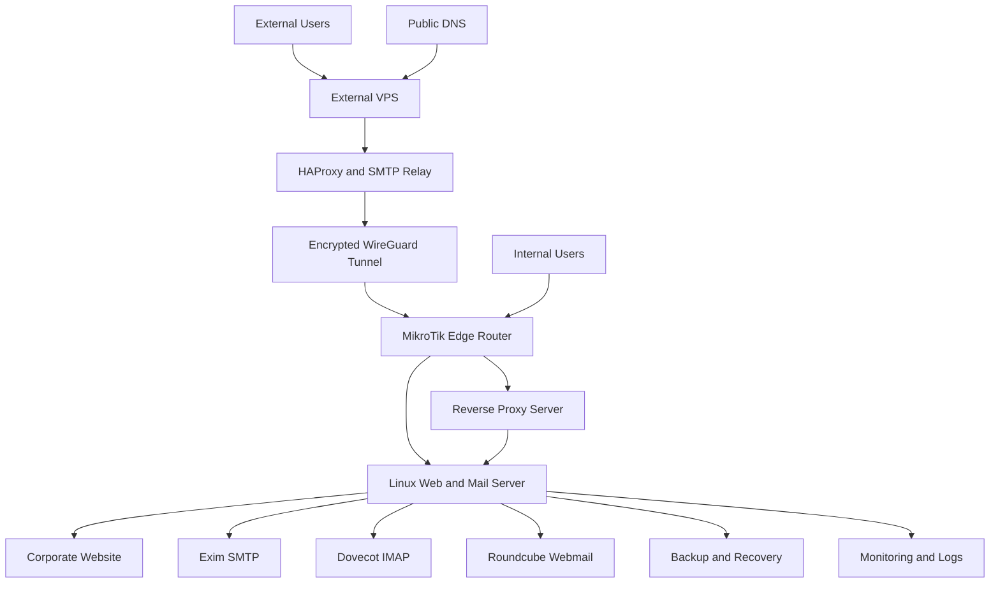

# Hybrid Corporate Web and Mail Infrastructure

[English](README.md) | [Deutsch](README.de.md) | [فارسی](README.fa.md) | [العربية](README.ar.md)

> **Sanitized production case study:** This repository documents a real infrastructure project that I designed, implemented, operated and troubleshot. Company identity, domains, addresses, credentials, production configuration, website source, screenshots, logs and backups are intentionally excluded.

[View the live portfolio](https://miladateight.github.io/hybrid-web-mail-infrastructure/)

## Executive Summary

This project combined corporate website delivery, Linux web and mail hosting, HestiaCP administration, Nginx, Exim, Dovecot, Roundcube, reverse proxying, an external VPS entry layer, HAProxy, WireGuard, MikroTik routing, firewall and NAT controls, policy-based routing, separate outbound SMTP delivery paths, DNS-based mail authentication, backup planning and incident recovery.

The public repository explains the engineering decisions and operational ownership without publishing values that could identify or expose the live environment.

## Project Context

The organization required one maintainable platform for its public website and corporate email services. Internal users needed dependable access through the company network, while external users required a controlled entry path. Outbound email delivery also had to follow different policies for different hosted sender domains.

## Engineering Challenge

The work required coordination across several layers:

- Deliver a corporate website through a Linux hosting environment.
- Operate web, SMTP, IMAP and webmail services from a centralized server platform.
- Support different internal and external access paths.
- Connect an external VPS to the internal edge through encrypted transport.
- Apply firewall, NAT and policy-routing decisions at the MikroTik edge.
- Route selected sender domains through an external SMTP relay while keeping other domains on direct delivery.
- Keep DNS authentication, TLS, routing and service behavior aligned.
- Build repeatable validation, backup and recovery procedures.

## My Role

I owned the cross-layer integration work. I designed and deployed the website presentation layer, administered the Linux hosting platform, configured web and mail services, integrated network and proxy components, implemented mail-routing policy, validated service behavior and handled production troubleshooting and recovery documentation.

## What I Implemented

- Designed and deployed the corporate website presentation layer.
- Built and administered the Linux web and mail hosting environment.
- Configured HestiaCP, Nginx, Exim, Dovecot and Roundcube.
- Implemented internal and external web and mail access paths.
- Integrated an external VPS through an encrypted WireGuard tunnel.
- Configured HAProxy for controlled external service access.
- Configured MikroTik firewall, NAT and policy-based routing.
- Implemented domain-based outbound SMTP routing with direct and relayed delivery paths.
- Configured and validated SPF, DKIM, DMARC, MX, PTR and TLS requirements.
- Investigated mail queues, service logs, TLS behavior and routing failures.
- Created backup, validation, troubleshooting and recovery procedures.

## High-Level Architecture



The diagram is intentionally generalized. It shows component relationships and responsibility boundaries, not the exact production topology.

## Web Platform

I designed and deployed the website layer, prepared it for Linux hosting, integrated HTTPS delivery and maintained the deployment files. Operational checks covered HTTP behavior, TLS validity, reverse-proxy behavior, filesystem permissions and service health after changes.

## Hosting Platform

HestiaCP acted as the hosting control plane for web domains, mail domains, certificates, mailboxes and backups. Nginx served the web layer, while Linux service management, permissions, logs and generated-configuration behavior were handled as separate operational concerns.

## Mail Platform

I integrated and administered:

- **Exim** for SMTP receiving, submission, routing and transport selection.
- **Dovecot** for IMAP mailbox access.
- **Roundcube** for browser-based webmail.
- **TLS** for protected client and server communication.
- **DNS authentication** for identity and deliverability.

Troubleshooting included queue inspection, log analysis, route selection, TLS validation and separation of application, network and DNS failures.

## Internal Access Flow

Internal users reached the hosting environment through the company network and MikroTik routing controls. This path reduced dependency on the external entry layer while keeping web, SMTP, IMAP and webmail services on the same managed hosting platform.

## External Access Flow

External users entered through a controlled VPS layer. HAProxy forwarded selected access flows through an encrypted WireGuard tunnel toward the internal edge, where MikroTik applied firewall, NAT and routing policy before traffic reached the hosting services.

## Domain-Based SMTP Routing

The hosting environment served multiple sender domains with different outbound requirements. I implemented sender-domain classification in the mail-routing layer so that each message selected one of two paths:

1. Direct outbound SMTP delivery.
2. Secure delivery through an external SMTP relay.

This separation allowed one hosted environment to maintain different delivery policies without forcing every domain through the same route. Validation covered router and transport selection, queue behavior, relay reachability, TLS and DNS alignment.

```text
if sender domain belongs to relay policy:
    select secure external relay transport
else:
    select direct outbound transport
```

The example above is conceptual pseudocode, not production configuration.

## DNS and Mail Authentication

I configured and validated the relationships between MX, SPF, DKIM, DMARC, PTR, mail hostnames and TLS certificates. These records and controls were reviewed together because deliverability failures often cross DNS, identity, transport and reputation boundaries.

## Network and Security Controls

The implementation included:

- Controlled public exposure through an external entry layer.
- MikroTik firewall and NAT boundaries.
- Policy-based routing for selected traffic.
- Encrypted WireGuard transport between infrastructure locations.
- TLS for web and mail access.
- Restricted administrative access and credential protection.
- Separation of public portfolio material from production configuration.
- Backup protection, logging, patching and change validation.

## Validation and Operations

Operational validation covered:

- Website availability and HTTPS behavior.
- TLS certificate and protocol checks.
- DNS and mail-authentication review.
- SMTP and IMAP access validation.
- Mail queue and route-selection inspection.
- WireGuard peer and encrypted-path checks.
- HAProxy backend reachability.
- MikroTik firewall, NAT and routing counters.
- Backup creation and restore readiness.
- Service-by-service checks after changes.

The public case study omits live evidence and operational identifiers.

## Incident Recovery Case Study

A filesystem-related change was followed by an HTTP 500 failure on the hosting control-panel login. Investigation showed that a required PHP dependency loader was unavailable and vendor dependencies required validation or restoration.

The recovery process separated hosted website content from the control-panel application, restored the required application dependency layer, validated service ownership and availability, and then checked web, mail and management services independently. The incident reinforced the need for path validation, change isolation, dependency checks and tested recovery notes.

See [Service Restoration](docs/service-restoration.md).

## Outcomes

- Centralized website and corporate mail operations on a maintainable Linux platform.
- Enabled controlled internal and external access to the same managed services.
- Established encrypted connectivity between external and internal infrastructure layers.
- Implemented separate outbound mail-delivery policies by sender domain.
- Improved troubleshooting visibility through logs, queues, counters and health checks.
- Created repeatable backup, validation and recovery documentation.

No fabricated metrics or availability claims are included.

## Technologies

**Web and hosting:** HTML, CSS, JavaScript, Linux, Ubuntu Server, HestiaCP, Nginx, reverse proxying, TLS  
**Mail:** Exim, Dovecot, Roundcube, SMTP, IMAP, SPF, DKIM, DMARC, MX, PTR  
**Network:** MikroTik RouterOS, WireGuard, HAProxy, NAT, firewall, policy-based routing, DNS, TCP/IP  
**Operations:** Bash, logging, monitoring, backup, incident recovery, troubleshooting, technical documentation

## Skills Demonstrated

- End-to-end infrastructure ownership
- Linux server administration
- Network and mail troubleshooting
- Web and mail hosting operations
- Secure remote-access architecture
- Reverse-proxy and SMTP-relay integration
- Domain-based mail routing
- DNS and TLS validation
- Backup and recovery planning
- Root-cause analysis
- Production support and documentation

## Repository Documentation

- [System Design](docs/system-design.md)
- [Web Platform](docs/web-platform.md)
- [Hosting Platform](docs/hosting-platform.md)
- [Mail Platform](docs/mail-platform.md)
- [Sender-Domain Delivery Policy](docs/delivery-policy.md)
- [Service Restoration](docs/service-restoration.md)
- [Project Status](docs/project-status.md)

## Running the Portfolio Locally

```bash
python3 -m http.server 8080
```

Then open `http://localhost:8080`. Direct `file://` access may block locale JSON loading in some browsers.

## Privacy and Confidentiality

This repository contains no real company identity, domains, addresses, hostnames, credentials, keys, DNS values, production configuration, original website source, screenshots, mailbox content, backups or logs. It is a technical portfolio narrative, not a deployment guide or infrastructure backup.

## Author

**Milad**  
IT Infrastructure Engineer | DevOps-Focused
