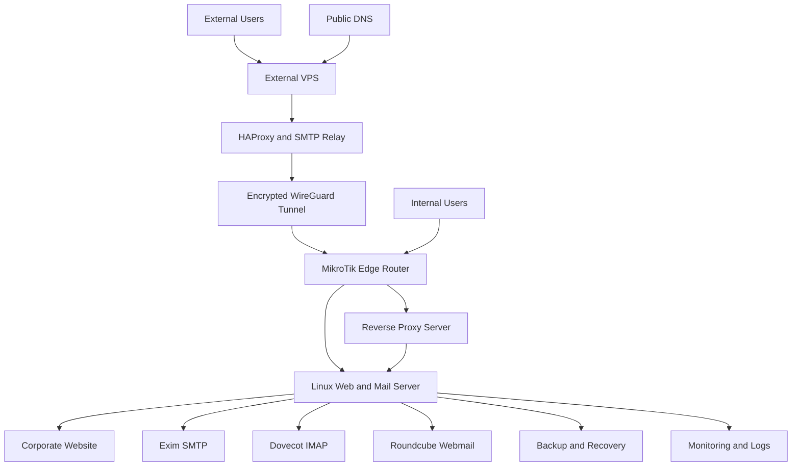

[English](README.md) | [Deutsch](README.de.md) | [فارسی](README.fa.md) | [العربية](README.ar.md)

# Hybrid Corporate Web and Mail Infrastructure

> **Sanitized production case study:** this repository documents a real infrastructure project implemented and operated by Milad. Company identity, production domains, addresses, credentials, configurations, website source, logs, screenshots and operational secrets are intentionally excluded.

## Executive Summary

This project combined corporate website delivery, Linux web and mail hosting, HestiaCP administration, Nginx, Exim, Dovecot, Roundcube, reverse proxying, an external VPS entry layer, HAProxy, WireGuard, MikroTik routing, firewall and NAT controls, policy-based routing, domain-specific outbound SMTP paths, DNS authentication, backup planning and incident recovery.

The public repository explains the engineering work and operational decisions without serving as a deployment guide or production backup.

## Project Context

The organization required one maintainable platform for a public website and corporate email while supporting different access paths for internal and external users. The hosting environment also needed controlled outbound mail delivery, encrypted connectivity between infrastructure locations, TLS-secured services, DNS-based mail authentication and repeatable recovery procedures.

## Engineering Challenge

The main challenge was coordinating web hosting, mail transport, remote access and routing as one system. A failure in DNS, TLS, proxying, firewall policy, mail routing or application dependencies could affect a different layer of the same user-facing service. The design therefore separated responsibilities clearly and defined validation steps across all layers.

## My Role

I designed and deployed the website presentation layer, administered the Linux hosting environment, configured the web and mail services, integrated secure remote connectivity, implemented routing policies, validated DNS and TLS behavior, investigated production incidents and documented recovery procedures.

## What I Implemented

- Designed and deployed the corporate website presentation layer.
- Built and administered the Linux web and mail hosting environment.
- Configured HestiaCP, Nginx, Exim, Dovecot and Roundcube.
- Implemented internal and external mail access paths.
- Integrated an external VPS through an encrypted WireGuard tunnel.
- Configured HAProxy for controlled external service access.
- Configured MikroTik firewall, NAT and policy-based routing.
- Implemented domain-based outbound SMTP routing with direct and relayed delivery paths.
- Configured and validated SPF, DKIM, DMARC, MX, PTR and TLS requirements.
- Created backup, validation, troubleshooting and recovery procedures.

## High-Level Architecture



The diagram is deliberately generalized. It contains no production identifiers, exact routes, addresses, ports or provider details.

## Web Platform

I designed and deployed the website layer, organized its assets, connected it to Linux hosting, configured HTTPS delivery and validated availability after deployment or filesystem changes. The production website source and company-owned content are not included here.

## Hosting Platform

HestiaCP provided the hosting control plane for web domains, mail domains, certificates and backups. Nginx delivered web traffic, while custom reverse-proxy and network behavior remained separate from control-panel-generated configuration. Operational work included service checks, permissions, ownership, logs and recovery boundaries.

## Mail Platform

I configured and maintained Exim for SMTP transport, Dovecot for mailbox access and Roundcube for browser-based webmail. The environment supported SMTP, IMAP and webmail for internal and external users over TLS-secured paths. Troubleshooting included queue inspection, log analysis, certificate validation, DNS review and route verification.

## Internal Access Flow

Internal users reached the web and mail services through the internal routed network and MikroTik edge policies. This path reduced dependence on the external entry layer while keeping access controls and service validation centralized.

## External Access Flow

External users connected through a controlled VPS entry layer. HAProxy forwarded selected services across an encrypted WireGuard tunnel toward the internal edge router and hosting environment. The core mail services remained in the controlled hosting network.

## Domain-Based SMTP Routing

I implemented different outbound delivery policies for hosted sender domains. Exim classified the sender domain and selected either direct delivery or a secure external relay transport. This allowed each hosted domain to use the delivery path appropriate to its operational requirements without applying one global route to every domain.

```text
if sender domain belongs to relay policy:
    select secure external relay transport
else:
    select direct outbound transport
```

The pseudocode is conceptual and is not production configuration.

## DNS and Mail Authentication

The implementation included coordinated MX, SPF, DKIM, DMARC, PTR and TLS requirements. Validation treated DNS identity, certificate behavior and the selected SMTP path as one deliverability chain rather than independent settings.

## Network and Security Controls

The project used controlled public exposure, MikroTik firewall and NAT policies, policy-based routing, encrypted WireGuard transport, TLS for web and mail, protected credentials, separated backups and post-change health checks. Security claims in this repository are intentionally restrained and do not imply that any system is risk-free.

## Validation and Operations

Operational procedures covered website availability, HTTP-to-HTTPS behavior, certificate validity, DNS records, SMTP and IMAP reachability, webmail availability, Exim queues, Dovecot health, WireGuard peer state, HAProxy backend reachability, MikroTik routing counters and restore validation.

## Incident Recovery Case Study

A production incident caused the hosting control panel login to return HTTP 500 because required PHP vendor dependencies were unavailable after a filesystem-related change. Recovery separated hosted website content from control-panel application files, restored or validated the dependency layer, checked service health and documented preventive controls. See [Incident Recovery](docs/incident-recovery.md).

## Outcomes

- Centralized web and mail operations under one maintainable model.
- Enabled controlled internal and external access to the same core services.
- Established encrypted connectivity between infrastructure locations.
- Implemented separate direct and relay SMTP delivery policies.
- Improved recovery readiness through validation and documentation.
- Preserved operational confidentiality in the public portfolio.

## Technologies

- **Web and hosting:** HTML, CSS, JavaScript, Linux, Ubuntu Server, HestiaCP, Nginx, TLS
- **Mail:** Exim, Dovecot, Roundcube, SMTP, IMAP, SPF, DKIM, DMARC, MX, PTR
- **Network:** MikroTik RouterOS, WireGuard, HAProxy, NAT, firewall, policy-based routing, DNS, TCP/IP
- **Operations:** Bash, logging, monitoring, backup, troubleshooting, incident recovery, technical documentation

## Skills Demonstrated

End-to-end infrastructure ownership, Linux administration, web hosting, mail administration, network engineering, cross-layer troubleshooting, secure remote access, reverse proxy integration, SMTP routing, DNS management, TLS validation, backup planning, incident recovery and technical documentation.

## Repository Documentation

- [Architecture](docs/architecture.md)
- [Web Platform](docs/web-platform.md)
- [Hosting Platform](docs/hosting-platform.md)
- [Mail Platform](docs/mail-platform.md)
- [Internal and External Access](docs/internal-external-access.md)
- [Mail Routing](docs/mail-routing.md)
- [Security](docs/security.md)
- [Testing Strategy](docs/testing-strategy.md)
- [Incident Recovery](docs/incident-recovery.md)

## Run Locally

```bash
python3 -m http.server 8080
```

Then open `http://localhost:8080`. Direct `file://` access may block locale JSON loading.

## Live Portfolio

[Open the GitHub Pages portfolio](https://miladateight.github.io/hybrid-web-mail-infrastructure/)

## Privacy and Confidentiality

This repository excludes the real company identity, website source, domains, hostnames, addresses, credentials, keys, production configuration, screenshots, logs, mailbox data and backups. It is an engineering narrative, not an operational blueprint.

## Author

**Milad**<br>
IT Infrastructure Engineer | DevOps-Focused
