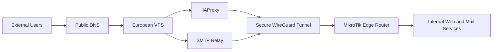

# External Access Flow

```mermaid
flowchart LR
  ExternalUsers["External Users"] --> PublicDNS["Public DNS"]
  PublicDNS --> EuropeanVPS["European VPS"]
  EuropeanVPS --> HAProxy["HAProxy"]
  EuropeanVPS --> SMTPRelay["SMTP Relay"]
  HAProxy --> Tunnel["Secure WireGuard Tunnel"]
  SMTPRelay --> Tunnel
  Tunnel --> Router["MikroTik Edge Router"]
  Router --> Services["Internal Web and Mail Services"]
```
