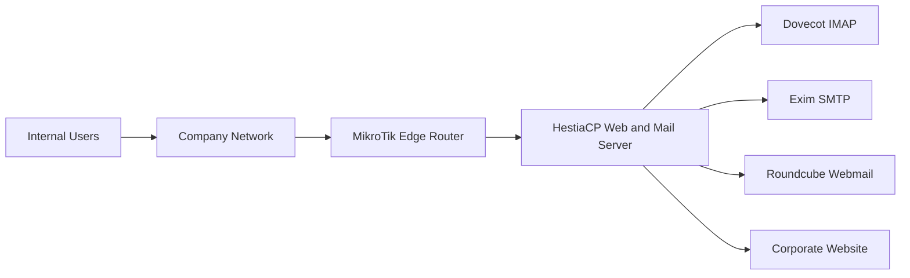

# Internal Access Flow

```mermaid
flowchart LR
  InternalUsers["Internal Users"] --> Network["Company Network"]
  Network --> Router["MikroTik Edge Router"]
  Router --> WebMail["HestiaCP Web and Mail Server"]
  WebMail --> IMAP["Dovecot IMAP"]
  WebMail --> SMTP["Exim SMTP"]
  WebMail --> Webmail["Roundcube Webmail"]
  WebMail --> Website["Corporate Website"]
```
