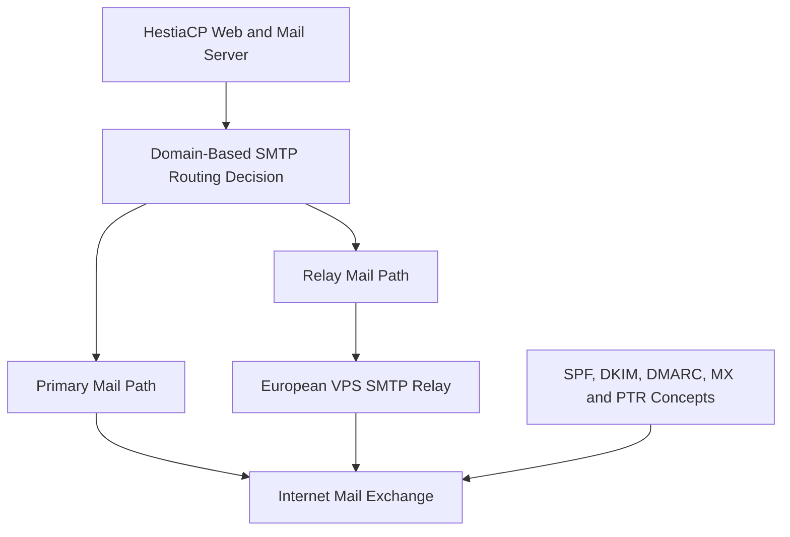

# Outbound Mail Flow

```mermaid
flowchart TB
  WebMail["HestiaCP Web and Mail Server"] --> Policy["Domain-Based SMTP Routing Decision"]
  Policy --> Direct["Primary Mail Path"]
  Policy --> Relay["Relay Mail Path"]
  Direct --> Internet["Internet Mail Exchange"]
  Relay --> EuropeanVPS["European VPS SMTP Relay"]
  EuropeanVPS --> Internet
  DNSAuth["SPF, DKIM, DMARC, MX and PTR Concepts"] --> Internet
```
