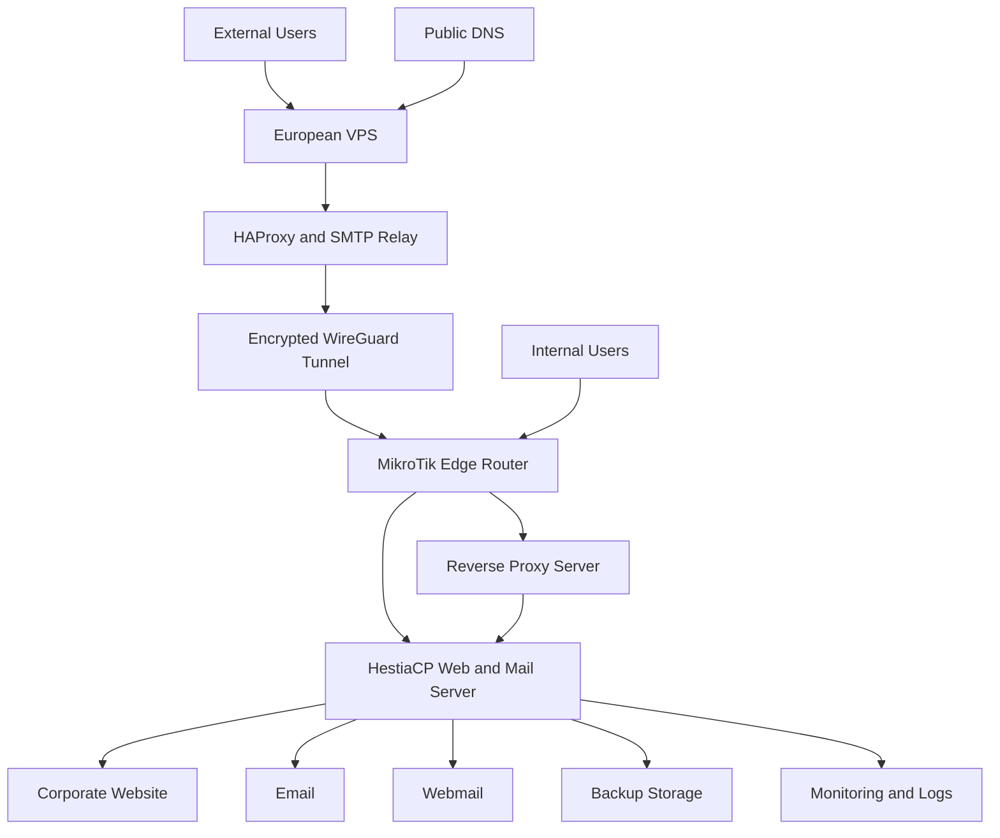

# Complete System Architecture

```mermaid
flowchart TB
  ExternalUsers["External Users"] --> EuropeanVPS["European VPS"]
  PublicDNS["Public DNS"] --> EuropeanVPS
  EuropeanVPS --> EdgeServices["HAProxy and SMTP Relay"]
  EdgeServices --> Tunnel["Encrypted WireGuard Tunnel"]
  Tunnel --> Router["MikroTik Edge Router"]
  InternalUsers["Internal Users"] --> Router
  Router --> ReverseProxy["Reverse Proxy Server"]
  Router --> WebMail["HestiaCP Web and Mail Server"]
  ReverseProxy --> WebMail
  WebMail --> Website["Corporate Website"]
  WebMail --> Email["Email"]
  WebMail --> Webmail["Webmail"]
  WebMail --> Backup["Backup Storage"]
  WebMail --> Monitoring["Monitoring and Logs"]
```
