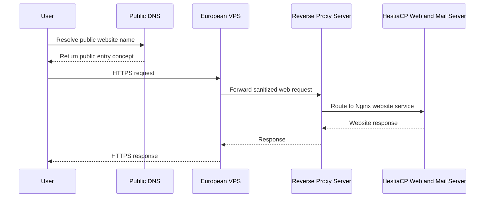

# Website Request Flow

```mermaid
sequenceDiagram
  participant User
  participant DNS as Public DNS
  participant Edge as European VPS
  participant Proxy as Reverse Proxy Server
  participant Web as HestiaCP Web and Mail Server
  User->>DNS: Resolve public website name
  DNS-->>User: Return public entry concept
  User->>Edge: HTTPS request
  Edge->>Proxy: Forward sanitized web request
  Proxy->>Web: Route to Nginx website service
  Web-->>Proxy: Website response
  Proxy-->>Edge: Response
  Edge-->>User: HTTPS response
```
